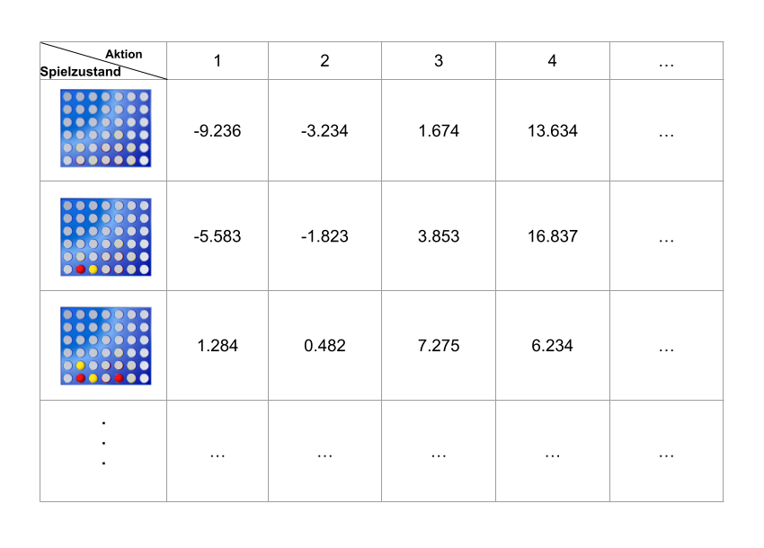
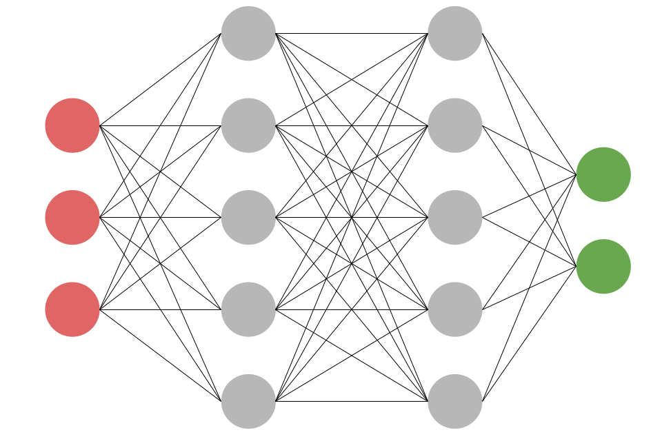

*Dieser Artikel ist eine Fortsetzung. Den Ursprünglichen findest du [hier](../boardGames/).*\
Im letzten Artikel habe ich besprochen, wie der Computer den besten Zug in einem Vier Gewinnt Spiel finden kann.
Diese Methoden haben immer mithilfe eines Suchbaumes zukünftige Spielsituationen analysiert, um so an den besten Zug zu kommen.\
Nun wollen wir uns mal ansehen, wie wir mit der Hilfe von Machine Learning (Maschinelles Lernen) den besten Zug finden können.
<!--more-->

## Was ist maschinelles Lernen?
Das maschinelle Lernen ist wohl einer der interessantesten Teilbereiche der künstlichen Intelligenz.
Hierfür wird der Computer trainiert, um eine bestimmte Aufgabe zu lösen. Bei diesem Training sammelt der Computer Erfahrung.
Diese Erfahrung kann er später nutzen, um die Aufgaben, für die er trainiert worden ist, selbstständig zu lösen.\
Also ähnlich wie bei uns Menschen.

Jedoch kann der Computer seinen Erfahrungsschatz nicht nutzen um ihn auf andere Aufgabengebiete zu übertragen.
Das bleibt bis jetzt nur den (meisten) Menschen vorbehalten. Ein Kollege hat da mal ein gutes Beispiel formuliert:
"Eine KI die darauf trainiert wird eine breite Treppe hochzugehen, kann das auch noch, wenn einer das Licht ausmacht.
Wenn man sie jedoch plötzlich auf eine Wendeltreppe stellt, wird sie gegen die Wand laufen."

Man kann maschinelles Lernen in drei große Bereiche einteilen: 
* Überwachtes Lernen
* Unüberwachtes Lernen
* Bestärkendes Lernen

Diese unterscheiden sich hauptsächlich in der Art des Trainings und wie die KI die Erfahrungswerte aufbereitet.
Wir wollen uns in diesem Artikel den Bereich bestärkendes Lernen (engl.: reinforcement learning) genauer ansehen.

## Was ist Reinforcement Learning
Beim bestärkenden Lernen probiert die KI verschiedene Aktionen aus. Für eine gute Aktion wird sie belohnt und für eine schlechte bestraft. 
Das Ziel der KI ist es, so viel Belohnungen wie möglich zu sammeln.\
Ich versuche das mal an einem Alltagsbeispiel zu erklären. Stell dir vor du willst das Lied "Für Elise" auf dem Klavier spielen lernen, hast aber bis jetzt nie Klavier gespielt.
Du wirst versuchen zufällige Tasten auf dem Klavier zu drücken. Irgendwann werden ein paar richtige dabei sein, und du wirst mit einem Glücksgefühl belohnt. 
Diese Tastenkombinationen gehen dann in deinen Erfahrungsschatz ein. So wirst du Stück für Stück das komplette Stück lernen.

Wie können wir das auf unser 4-Gewinnt Spiel anwenden? Die KI wird am Anfang, immer wenn sie an der Reihe ist, einen Stein in eine zufällige Spalte werfen. 
Hat die KI am Schluss gewonnen, weiß sie, dass die Züge nicht schlecht waren. Hat sie verloren, weiß sie, dass sie etwas besser machen muss.

Das ganze ist nur ein grober Plan und es gibt noch viele unbeantwortete Fragen. Wie verwalten wir unseren Erfahrungsschatz? Wie können wir aus ihm die beste Aktion auswählen?
Wie können wir neue Taktiken ausprobieren, um unseren Erfahrungsschatz zu erweitern? Diese Frage kann uns Reinforcement Learning nicht beantwortet. Das will es auch gar nicht, 
es ist ja nur ein grobes Regelwerk.\
Um diese Fragen zu beantworten, schauen wir uns die Methode des Q-Learnings an.

## Was ist Q-Learning
Q-Learning ist eine spezielle Methode des bestärkenden Lernens. Das Herzstück dieser Methode ist die Q-Tabelle (zumindest in der einfachsten Form der Methode).
In dieser Tabelle werden alle Erfahrungswerte gespeichert, die die KI gesammelt hat.

Ab jetzt wird es wieder etwas mathematischer, aber keine Angst, es hält sich in Grenzen.

### Q-Tabelle
Zunächst schauen wir uns einmal die Q-Tabelle an.

Hier zusehen ist ein Ausschnitt der Q-Tabelle für unser Vier Gewinnt Spiel. Links sind alle möglichen Spielzustände abgebildet, die auftreten könnten. 
Oben sieht man die Aktionen, die auf einen Spielzustand angewandt werden können. Zur Wiederholung: Bei uns ist eine Aktion durch die jeweilige Spalte gekennzeichnet,
in der wir einen Spielstein einwerfen können.\
Die Tabelle ist mit Q-Werten (für uns Erfahrungswerte) gefüllt. Sie geben an, wie "gut" ein Zug in einer gewissen Spielsituation ist.\
Gehen wir zunächst davon aus, dass wir die Q-Tabelle bereits existiert und wir nun ein Spiel starten wollen. Immer wenn die KI am Zug ist, sucht 
sie den jetzigen Spielzustand in der Tabelle und sieht sich die Aktionen, die sich für den Zustand in der Tabelle befinden, an. Sie wählt dann die Aktion (bzw. Spalte) mit dem höchsten Q-Wert.

Ein Beispiel mit der oben abgebildeten Q-Tabelle. Gehen wir davon aus, dass die KI am Zug ist und noch keiner einen Stein eingeworfen hat. Die KI würde nun ihren Stein in die 4te Spalte werfen,
da diese Aktion den höchsten Q-Wert (13.634) besitzt.

### Taining
Die Q-Tabelle ist das Ergebnis des Trainings der KI. Wie sieht nun das Training aus?\
Am Anfang muss man die Tabelle mit einem festgelegten Wert füllen. Welchen Wert man genau wählt, ist eine Wissenschaft für sich. 
Für unser Beispiel nehmen wir den Wert 0. Also füllen wir jede Zelle mit der 0 auf.

Nun starten wir die eigentliche Trainingsphase. Im Allgemeinen sieht diese so aus, dass wir die KI viele Spiele gegen Gegner spielen lassen.
Dabei aktualisiert die KI immer wieder die Werte in der Q-Tabelle.\
Sehen wir uns das mal genauer an. Der Gegner hat gerade seinen Zug gemacht, jetzt ist die KI dran. Sie sieht in der Q-Tabelle nach, welche Werte die Aktionen für den aktuellen Spielzustand besitzen.
Sie wählt nun die Aktion mit dem höchsten Wert (bei Gleichstand wird zufällig gewählt). Die Aktion wird jetzt von der KI gespielt.\
Jetzt wird der Wert der Aktion aktualisiert, die gerade ausgewählt worden ist. Dafür wird die folgende Formel angewendet:
$$
Q_{new}(s_{t},a_{t}) = (1 - \alpha) \cdot Q_{old}(s_{t},a_{t}) + \alpha \cdot \bigg(r_{t} + \max_{a}Q(s_{t+1}, a) \bigg) 
$$\
Die Funktion $Q(s_{t}, a_{t})$ steht für den Wert in der Q-Tabelle mit dem Spielzustand $$s_{t}$$ und der Aktion $$a_{t}$$.
Der Wert $\alpha$ steht für die Lernrate, d.h. wie stark wird der Wert geändert. Bei einem kleinem $\alpha$ weicht der geänderte Wert nur leicht vom alten Wert ab.
$\alpha$ kann frei zwischen 0 und 1 gewählt werden.\
$r_{t}$ beschreibt die Belohnung. Wenn die gewählte Zustand unmittelbar einen Gewinn auslöst, setzen wir hierfür 1 ein. Wenn der Zug eine unmittelbare Niederlage auslöst, wird -1 eingesetzt.
Ansonsten bleibt $r_{t}$ bei 0.\
Der Teil $\max_{a}Q(s_{t+1}, a)$ ist der größte Q-Wert für die resultierende Spielsituation. Also für den Spielzustand, der nach unserer Aktion entstanden ist.

Um nun zu verhindern, dass die KI Aktionen nicht wählt, nur weil sie diese noch nie ausprobiert hat bzw. einmal zu einer Niederlage geführt haben, gibt es die Methode des Epsilon-Greedy Algorithmus.
Dabei wird ein Wert $\epsilon$ zwischen 0 und 1 gewählt. Dieser Wert gibt an, mit welcher Wahrscheinlichkeit die KI eine völlig zufällige Aktion auswählt. So kann man sicher gehen, dass auch vermeintlich
schlechte Aktionen von der KI während der Trainingsphase ausgewählt werden.

Das Training wird nun so lange durchgeführt, bis sich die Werte in der Q-Tabelle nur noch wenig ändern. Wie lange das dauert, hängt stark von der Größe der Tabelle ab.

### Wir haben ein Problem
Wie groß wird die Tabelle nun bei unserem Vier Gewinnt Spiel? Das hängt von der Menge der möglichen Spielzustände ab. Wer den [letzten Artikel](../boardGames) aufmerksam gelesen hat, wird feststellen,
dass es eine Menge an Spielzuständen gibt. 4.531.985.219.092 um genau zu sein. Wir bräuchten also mehrere Terrabyte Speicherplatz um die Tabelle unterzubringen. 
Obwohl das bestimmt möglich wäre, ist es ziemlich unpraktisch. Wir müssen unsere Tabelle also verkleinern oder besser noch, ersetzen.

Wir brauchen also eine Funktion, die uns anhand des Spielzustandes die Q-Werte für die möglichen Aktionen zurückgibt.
Wenn wir die Tabelle loswerden wollen, können wir nicht erwarten, dass die Funktion uns die exakten Werte liefert. Dafür bräuchten wir ja die Tabelle.
Aber die Funktion kann eine Annäherung der Werte, die in der Tabelle stehen würden, zurückgeben. Deshalb wird eine solche Funktion *Approximationsfunktion* genannt.

## Deep-Q-Learning
Es gibt viele Möglichkeiten eine solche Approximationsfunktion abzubilden. Die wohl beliebteste Methode ist das neuronale Netz.

Das neuronale Netz ist der Funktionsweise unseres Gehirns nachempfunden. Eine Menge von künstlicher Neuronen sind in einem großen Verbund zusammen vernetzt.
Jedes künstliche Neuron kann Daten aufnehmen, eine einfache Berechnung ausführen und das Ergebnis anschließend weiterschicken. Während des Trainings werden die Parameter der Berechnung feinjustiert.
Durch dieses einfache Prinzip können verschiedene Aufgaben von dem neuronalen Netz gelöst werden, von der Bilderkennung bis zur Sprachverarbeitung.

In dem folgendem Bild ist ein neuronales Netz abgebildet.

Wie man sehen kann, ist ein neuronales Netz in Schichten unterteilt. Die Neuronen (Kreise) jeder Schicht sind jeweils mit allen anderen Neuronen der nächsten Schicht verbunden.
Es gibt immer ein Input Layer (Eingabeschicht) (hier rot) und ein Output Layer (Ausgabeschicht) (grün). Dazwischen liegen ein oder mehrere Hidden Layers (Verborgene Schichten) (grau).

Ich versuche das mal mit einem Beispiel zu veranschaulichen. 

### Funktionsweise eines neuronalen Netzes
Wir haben kleine Bildchen gegeben mit zehn auf zehn Pixeln. Auf diesen Bildern ist jeweils eine handschriftliche Ziffer abgebildet.
Das neuronale Netz soll nun ein Bild als Eingabe verwenden und ausgeben, welche Zahl am wahrscheinlichsten auf dem Bild abgebildet ist.\
Wie sieht unser Netz nun aus? Am einfachsten wäre es, wenn man für jeden einzelnen Pixel ein einzelnes Neuron im Input Layer anlegt. D.h. wir benötigen 100 Neuronen im Input Layer.
Im Output Layer legen wir 10 Neuronen an. Für jede Ziffer (0-9) eine. Am Schluss sollen Werte von 0 bis 1 in den Neuronen des Output Layers stehen. Je näher sich der Wert bei 1 befindet,
desto Wahrscheinlicher ist es die Ziffer, die das Neuron repräsentiert.\
Wie genau die Hidden Layers organisiert sind, ist eine Wissenschaft für sich. Für die meisten einfacheren Probleme ist ein einzelnes Hidden Layer ausreichend.
Die Anzahl der Neuronen sollte irgendwo zwischen Größe des Input und Output Layers sein.

In der Trainingsphase werden dem neuronalen Netz eine Menge an Bildern gezeigt, von denen wir bereits die abgebildete Ziffer kennen.
Wurde ins Netz ein Bild eingespeist, so bilden wir die Differenz zwischen der Ausgabe des Netzes und der erwünschten Ausgabe.\
Nun wird ein Rückwärtsdurchlauf (engl: Backpropagation) durchgeführt. Dabei werden die Gewichte und Parameter der Neuronen schrittweise angepasst, 
um die Differenz zu minimieren.

### Neuronales Netz als Approximationsfunktion
Wie bauen wir nun unser neuronales Netz um eine Q-Tabelle zu ersetzen?

Nach der Trainingsphase sollte der Fehler so minimal sein, dass das Netz brauchbare Ergebnisse liefert, auch für Eingaben, die das Netz nicht während des Trainings gesehen hat.
 
